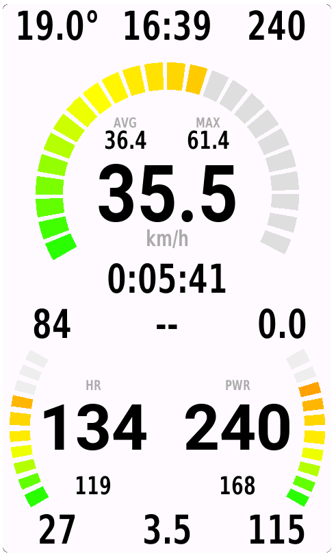
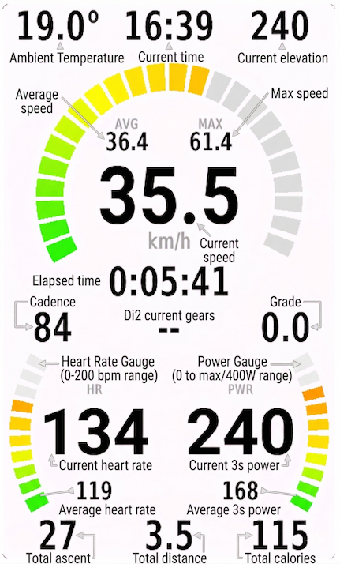

# Dash Data Field for Garmin Edge 1050

Dash is a custom data field for Garmin Edge 1050, built using Garmin's Connect IQ platform. It provides advanced cycling metrics and background services to enhance your ride experience.

## Data fields:

1. Top row:
    - Ambient Temperature (left)
    - Current time (center)
    - Current elevation (right)

2. Speed gauge:
    - Average speed (top left)
    - Max speed (top right)
    - Current speed (center)

3. Middle row:
    - Elapsed time (top)
    - Cadence (bottom left)
    - Di2 current gears (bottom center)
    - Grade (bottom right)

4. Heart rate & Power gauge:
    - Current heart rate between 0 and 200 bpm (left gauge)
    - Current heart rate (center left)
    - Average heart rate (bottom left)
    - Current 3s power (center right)
    - Average 3s power (bottom right)
    - Current power between 0 and larger of 400W and max power (right gauge)

4. Bottom row:
    - Total ascent (left)
    - Total distance (center)
    - Total calories (right)

## Installation

Because you aren't downloading this from the Connect IQ Store yet, you will need to manually copy the file onto the device's hard drive. Here are the simple, step-by-step instructions you can follow:

### Phase 1: Transferring the File to Your Edge
1. Build the project using the Monkey C SDK and Connect IQ tools or download the pre-built PRG file from the releases section of this repository.
2. Plug your Garmin Edge 1050 into your PC or Mac using a USB cable.
3. Open the Garmin Drive: Wait a moment for the computer to recognize the device. Open your file explorer (Windows) or Finder (Mac) and open the drive named GARMIN.
4. Navigate to the Apps Folder: Double-click the folder named Garmin, and then open the folder named Apps (GARMIN/Garmin/Apps/).
5. Copy the File: Drag and drop your compiled Dash.prg file directly into this Apps folder.
6. Safely Disconnect: Safely eject the Garmin drive from your computer and unplug the USB cable. The Edge will power on (or reboot) and automatically install your new data field.
2. Deploy the generated PRG file to your Garmin Edge 1050 device.
3. Add the Dash data field to your activity profile on the device.

### Phase 2: Adding the Data Field to Your Screen

1. On your Edge home screen, go to Settings (the three lines or gear icon) > Activity Profiles.
2. Select the profile you want to use (e.g., Road, Indoor, etc.).
3. Select Data Screens.
4. Choose an existing screen to edit, or click Add New. Dash is a complex data field and you should use it in "1-Field" layout so it takes up the whole screen.
5. Tap the data field on the screen that you want to replace.
6. In the category list that pops up, scroll down and select Connect IQ.
7. Select Dash from the list.
8. Hit the back button to save your changes.

That's it! When you start a ride with that profile, your custom UI will be live on the screen.

## Development
### Prerequisites
- [Garmin Connect IQ SDK](https://developer.garmin.com/connect-iq/sdk/)
- [Monkey C plugin for VS Code](https://marketplace.visualstudio.com/items?itemName=garmin.monkey-c)

### Build & Deploy
1. Open the project in VS Code.
2. Use the Monkey C commands to build and deploy:
	- `Monkey C: Build for Device`
	- `Monkey C: Install to Device`

### Project Structure
- `source/` — Main Monkey C source files
- `resources/` — Layouts, drawables, and strings
- `assets/` — Images and icons
- `bin/` — Build outputs

### Main Files
- `DashApp.mc` — Application entry point
- `DashView.mc` — UI logic
- `DashBackground.mc` — Background service logic
- `GlobalBackgroundService.mc` — Global background handler

## Contributing
Pull requests are welcome! For major changes, please open an issue first to discuss what you would like to change.

## License
This project is licensed under the MIT License.