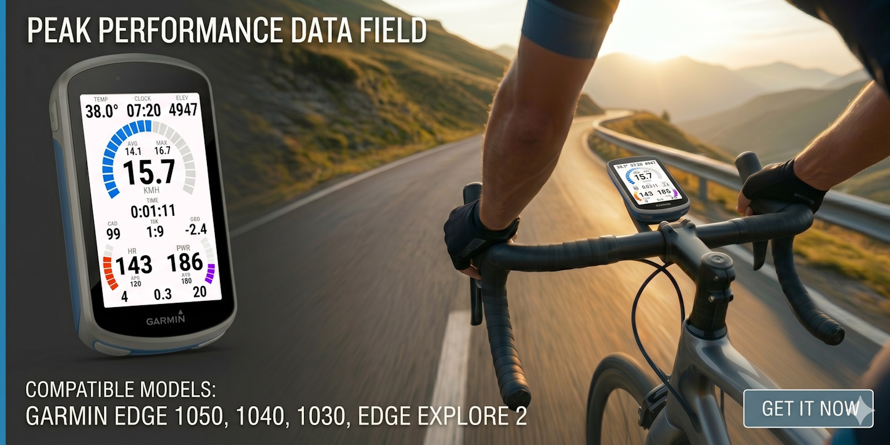
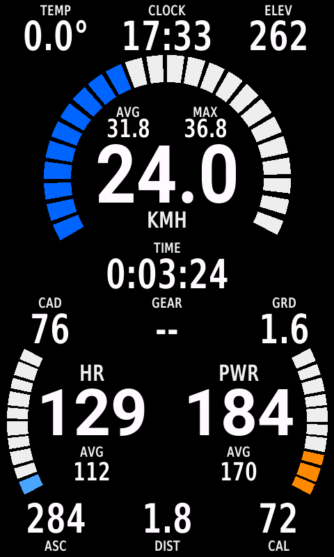
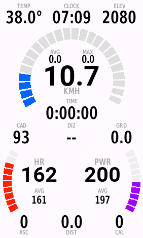
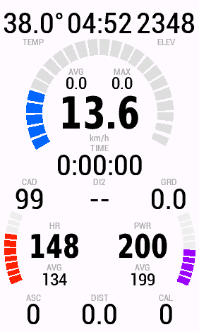
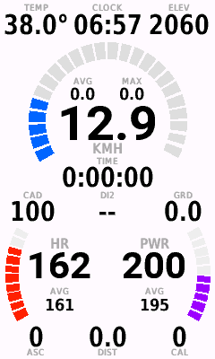
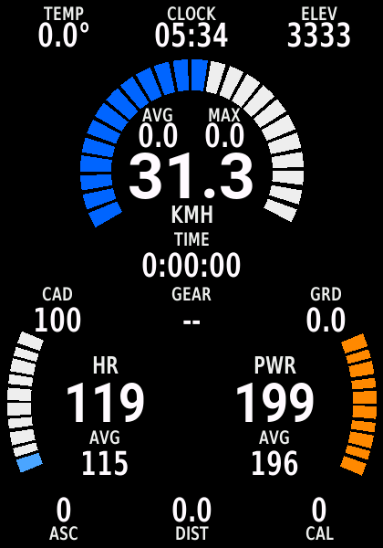
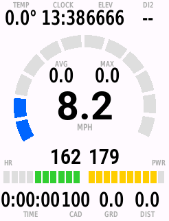
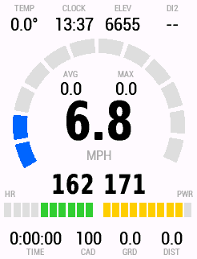

# Dash - Peak Performance Data Field



Dash is a full-screen data field for Garmin Edge cycling computers, built on Garmin's Connect IQ platform. It puts the numbers you actually ride to on one screen — speed, heart rate, power, cadence, grade, gears — and draws heart rate and power as zone-coloured gauges, so you can read your effort at a glance instead of reading a number.

**[Available in the Garmin Connect IQ Store](https://apps.garmin.com/apps/006a95b6-3619-47ec-a796-496a8dd6a3c9)**

<hr>

|  |  |  |  |
|:-:|:-:|:-:|:-:|
| Edge 1050 | Edge 1040 | Edge 1030 | Edge Explore 2 |

|  |  |  |
|:-:|:-:|:-:|
| Edge 850 / 550 | Edge 840 / 540 | Edge 830 / 530 |

## Supported devices

Requires Connect IQ 3.2 or newer. Dash adapts its layout to the screen it is running on — the larger screens get the full dashboard, the 2.6" screens get a condensed version of it.

| Device | Screen | Layout |
|---|---|---|
| Edge 1050 | 480 × 800 | Full |
| Edge 1040 / 1040 Solar | 282 × 470 | Full |
| Edge 1030 / 1030 Plus / 1030 Bontrager | 282 × 470 | Full |
| Edge 850 / 550 | 420 × 600 | Full |
| Edge Explore 2 | 240 × 400 | Full |
| Edge 840 / 540 | 246 × 322 | Compact |
| Edge 830 / 530 | 246 × 322 | Compact |

Dash is a full-screen field: add it to a **1-Field** data screen so it has the whole display to work with.

## What's on screen

1. **Top row**
    - Ambient temperature (left)
    - Current time (center)
    - Current elevation (right)

2. **Speed gauge** — a 24-segment arc reading 0–60 km/h (0–40 mph)
    - Average speed (top left)
    - Max speed (top right)
    - Current speed (center)

3. **Middle row**
    - Elapsed time (top)
    - Cadence (bottom left)
    - Di2 current gears (bottom center)
    - Grade (bottom right)

4. **Heart rate & power gauges**
    - Current heart rate, scaled to your heart rate zones (left gauge)
    - Current heart rate (center left)
    - Average heart rate (bottom left)
    - Current 3s power (center right)
    - Average 3s power (bottom right)
    - Current power, scaled to your FTP or your session max power, whichever is higher (right gauge)

5. **Bottom row**
    - Total ascent (left)
    - Total distance (center)
    - Total calories (right)

### Training zone colours

Both gauges are coloured by training zone, from blue (zone 1) through green, yellow and orange to red (zone 5).

Heart rate zones are taken from your Garmin user profile for the current sport. Power zones are derived from your FTP using Coggan-style boundaries — the FTP is read from your Garmin user profile on devices whose firmware exposes it (Connect IQ 5.2.2 and newer), with a fallback to the app's **FTP (Watts)** setting. If no zone data is available at all, the gauges fall back to a single colour.

### No power meter?

If you don't have a power meter, the right gauge becomes a cadence gauge reading 0–150 rpm, showing current and average cadence, label and all.

### The compact layout — Edge 840 / 540 and 830 / 530

These are 2.6" screens at 246 × 322 px, about a fifth of the pixel area of a 1050. Everything above still fits at a readable size only if some of it goes, so those four devices get a condensed four-band layout:

1. Ambient temperature, current time, elevation and Di2 gears
2. Speed gauge with the current speed at its centre
3. Heart rate and power as horizontal zone bars, coloured by training zone exactly as the round gauges are
4. Elapsed time, cadence, grade and distance

What is dropped is the data you look at after the ride rather than during it: average and max speed, average heart rate, average power, total ascent and calories. Without a power meter the right bar becomes a cadence bar as above, and the cadence slot in the bottom row shows total ascent instead.

### Units & appearance

All values automatically adapt to your device settings: speed in km/h or mph, distance in km or miles, elevation and ascent in metres or feet, and temperature in °C or °F. The UI also follows your device's light or dark background colour setting.

### Grade and temperature

Grade is calculated from GPS altitude and distance, updated every 20 m of travel, smoothed and capped at ±30%.

Ambient temperature comes from the device's built-in sensor. Not every Edge exposes it to a data field directly, so Dash also runs a background service that samples it every 5 minutes and falls back through the other sources the device does offer.

## Settings

Configurable in Garmin Connect (or Connect IQ) under the app's settings:

| Setting | Range | Default | What it does |
|---|---|---|---|
| **FTP (Watts)** | 0–600 | 200 | Functional threshold power, used to derive the power zone colours and to scale the power gauge. Only used when your Garmin user profile has no FTP set, or when the device cannot report it. |

## Installation

If you are installing from the Connect IQ Store, installation is automatic — skip to [Phase 2](#phase-2-adding-dash-to-a-data-screen). To sideload a build instead, follow both phases.

### Phase 1: Transferring the file to your Edge

1. Build the project using the Monkey C SDK and Connect IQ tools, or download the pre-built PRG file from the releases section of this repository.
2. Plug your Garmin Edge into your PC or Mac using a USB cable.
3. Open the Garmin drive: wait a moment for the computer to recognize the device, then open your file explorer (Windows) or Finder (Mac) and open the drive named GARMIN.
4. Navigate to the apps folder: double-click the folder named Garmin, and then open the folder named Apps (GARMIN/Garmin/Apps/).
5. Copy the file: drag and drop your compiled Dash.prg file directly into this Apps folder.
6. Safely eject the Garmin drive from your computer and unplug the USB cable. The Edge will power on (or reboot) and automatically install your new data field.

### Phase 2: Adding Dash to a data screen

1. On your Edge home screen, go to Settings (the three lines or gear icon) > Activity Profiles.
2. Select the profile you want to use (e.g. Road, Indoor, etc.).
3. Select Data Screens.
4. Choose an existing screen to edit, or click Add New. Dash is a complex data field and should be used in a **1-Field** layout so it takes up the whole screen.
5. Tap the data field on the screen that you want to replace.
6. In the category list that pops up, scroll down and select Connect IQ.
7. Select Dash from the list.
8. Hit the back button to save your changes.

That's it! When you start a ride with that profile, your custom UI will be live on the screen.

## Development

### Prerequisites

- [Garmin Connect IQ SDK](https://developer.garmin.com/connect-iq/sdk/)
- [Monkey C plugin for VS Code](https://marketplace.visualstudio.com/items?itemName=garmin.monkey-c)

### Build & run

In VS Code, use the Monkey C commands from the command palette:

- `Monkey C: Build for Device`
- `Monkey C: Run` (F5) to launch it in the simulator
- `Monkey C: Install to Device`

Or from the command line:

```powershell
$sdk = (Get-Content "$env:APPDATA\Garmin\ConnectIQ\current-sdk.cfg").Trim()
& "$sdk\bin\monkeyc.bat" -f monkey.jungle -o bin/Dash.prg -y <developer_key.der> -d edge1050
& "$sdk\bin\connectiq.bat"                      # start the simulator, then:
& "$sdk\bin\monkeydo.bat" bin/Dash.prg edge1050
```

The layout is tuned per device, so build against more than one target after changing anything that draws.

### Project structure

- `source/` — Monkey C source files
- `resources/` — drawables, strings, and the app setting (FTP)
- `resources-<product>/` — per-device overrides, picked up automatically by product id
- `assets/` — images and icons
- `bin/` — build outputs

### Main files

- `DashApp.mc` — application entry point; registers a background service that runs every 5 minutes to fetch ambient temperature from the device sensor
- `DashView.mc` — UI logic; computes and renders every metric, resolves the device layout, and calculates real-time grade from GPS altitude and distance (updated every 20 m, capped at ±30%)
- `DashBackground.mc` — background service logic
- `GlobalBackgroundService.mc` — global background handler

## Contributing

Pull requests are welcome! For major changes, please open an issue first to discuss what you would like to change.

## License

This project is licensed under the MIT License.
